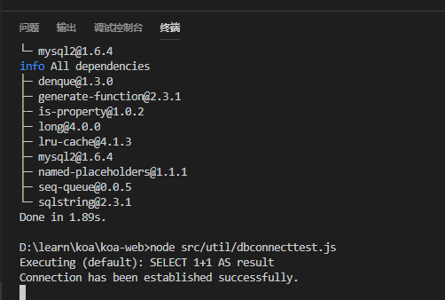

## 1. 初始化
`npm init -y`

## 2. 安装koa的常用基础包
```
yarn add koa koa-router koa-json kcors koa-bodyparser koa-static koa-logger

// 安装 koa-art-template 模板引擎
yarn add koa-art-template
// 使用 koa-art-template中间件 必然要先安装 art-template
yarn add art-template
```

## 3. src/app.js 搭建基本的koa 代码  
1. //src/router/routes.js  基本的路由
```javascript
const Router = require('koa-router')
// const musicCtrl = require('../controller/music')   // 这里引入controller

module.exports = app => {
    const router = new Router()

    const apiRouter = new Router()

    router.get('/', async(ctx,next) => {
        ctx.type = 'text/html'
        ctx.body = `<h1>这里是Koa首页</h1>`
    })

    // apiRouter.get('/music/focuslist',musicCtrl.focuslist)  //取焦点图列表

    //设定api路由为router的子路由
    router.use('/api', apiRouter.routes(), apiRouter.allowedMethods())
    
    //如果匹配不到路由则返回404
    router.all('/*', async (ctx, next) => {
        ctx.response.status = 404;
        ctx.response.body = `<h1>~~oops page not found!</h1>`
    })
    app.use(router.routes()).use(router.allowedMethods())
}
```
2. //src/config/config.js 基本的配置
```javascript
const env = process.env.NODE_ENV || 'development'

let port,database;

if(env === 'development') { // 如果是开发环境
    port = 5000
    database = {
        host: 'localhost',
        database: 'koa-test',
        username: 'root',
        password: '123456',
        port: '3306'
    }
}

if(env === 'production') {  //如果是生产环境
    
}

module.exports = {
    port,
    database
}
```
3. //src/app.js  koa基本代码
```javascript
const Koa = require('koa')
const path = require('path')
const koalogger = require('koa-logger')
const cors = require('kcors')
const json = require('koa-json')
const bodyparser = require('koa-bodyparser')
const render = require('koa-art-template')           //art-template模板引擎
const static = require('koa-static')                 //静态资源
const { port } = require('./config/config')
const router = require('./router/routes')
// const { formatDate } = require('./util/formatdate')


const app=new Koa()
render(app, {
    root: path.join(__dirname,'view'),   //视图存放地址
    extname:'.html',
    debug: process.env.NODE_ENV !== 'production'
})
app.use(static(path.join( __dirname,  './public')))
app.use(cors({credentials: true}))       //允许跨域,并且允许附带cookie
app.use(koalogger())
app.use(json())
app.use(bodyparser())

// 加载路由
router(app)

app.listen(port, ()=> {
    console.log(`server is running at http://localhost:${port}`)
})
```
## 4. 安装开发环境的nodemon 并在package.json中配置启动脚本
`yarn add nodemon -D`
```
"scripts": {
    "dev": "nodemon -w src src/app.js",
    "test": "echo \"Error: no test specified\" && exit 1"
  },
```
现在可以启动试一试：
`npm run dev`

## 5. 添加node.js的数据库访问orm sequelize
[sequelize官方文档](http://docs.sequelizejs.com/manual/installation/getting-started.html)
`yarn add sequelize`   

`yarn add tedious`     --这是sqlserver  
如果是使用mysql数据库,则是安装mysql2
`yarn add mysql2`

## 6. 编写数据连接和测试
//src/util/mysqldb.js
```javascript
const Sequelize = require('sequelize')
const { database } = require('../config/config')   //配置文件

const sequelize = new Sequelize(database.database, database.username, database.password, {
    host: database.host,
    dialect: 'mysql',
    operatorsAliases: false,
    pool: {
        max: 5,   // 连接池中最大连接数量
        min: 0,
        acquire: 30000,
        idle: 10000  // 如果一个线程 10 秒钟内没有被使用过的话，那么就释放线程
    },
    define: {
        freezeTableName: true,  // 如果为 true 则表的名称和 model 相同，即 user  为 false MySQL创建的表名称会是复数 users
        timestamps: false
    }
})

/*  测试是否可以连接成功
sequelize
  .authenticate()
  .then(() => {
    console.log('Connection has been established successfully.');
  })
  .catch(err => {
    console.error('Unable to connect to the database:', err);
  });
*/
module.exports = sequelize
```
//src/util/dbconnecttest.js 数据库连接测试代码
```javascript
const sequelize = require('./mysqldb.js')
/*  测试是否可以连接成功 */
sequelize
    .authenticate()
    .then(() => {
        console.log('Connection has been established successfully.');
    })
    .catch(err => {
        console.error('Unable to connect to the database:', err);
    });
```


## 7. 写model
//src/models/Singer.js
```
const Sequelize=require('sequelize')
const sequelize=require('../util/mysqldb')

const Singer=sequelize.define('singer',{
  id: {
    type:Sequelize.INTEGER,     //自增主键
    primaryKey:true,
    autoIncrement:true
  },
  country:Sequelize.STRING,         //因为是手动建的表,所以model中的长度啥的都可以不定义  
  singer_id:Sequelize.STRING,
  singer_mid:Sequelize.STRING,
  singer_name:Sequelize.STRING,
  singer_pic:Sequelize.STRING,
  area:Sequelize.INTEGER,
  genre:Sequelize.INTEGER,
  index:Sequelize.INTEGER,
  sex:Sequelize.INTEGER,
  createTime:Sequelize.STRING
},{
    tableName:'tb_music_singer'
})

module.exports=Singer
```
